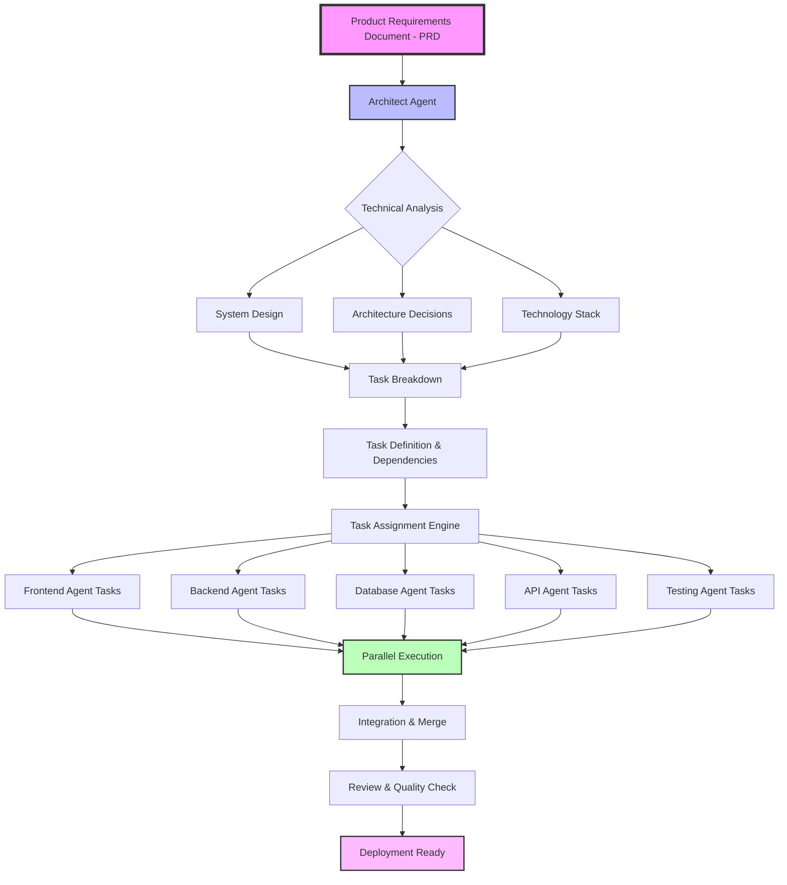

# Agent Documentation Template

A comprehensive multi-agent development framework that enables parallel,
AI-driven software development with specialized agent roles and file-based task
management.

## Overview

This template transforms how teams work with AI agents by providing:

- **Specialized Agent Roles** - Architect, Planner, Developer, Tester, Docs, PM
- **Parallel Task Execution** - Multiple agents work simultaneously
- **File-Based Task Management** - Simple folder structure for task flow
- **Continuous Documentation** - Docs stay synchronized with code
- **PRD-Driven Development** - Start from requirements, not implementation

## Key Features

- **Multi-Agent Orchestration**: Six specialized agents with distinct
  responsibilities
- **Folder-Based Tasks**: Simple `todo/` → `in-progress/` → `done/` workflow
- **Dependency Management**: Automatic task sequencing and blocking
- **Documentation-First**: PRDs drive development, docs update automatically
- **Command Integration**: Slash commands for Claude, @ commands for Cursor
- **Parallel Workstreams**: Frontend, backend, database, and infra tasks run
  concurrently
- **Token Optimized**: Minimal command files reference full documentation
- **Organized Structure**: Agent operations in `.agents/`, documentation in `docs/`

## Getting Started

### For New Features
1. **Copy this template** to your project repository
2. **Read CLAUDE.md or AGENTS.md** depending on whether you're using Claude or Cursor
3. **Create your first PRD** in `docs/product/[feature-name].md`
4. **Run the Architect** to design the solution:
   `/architect docs/product/[feature-name].md`
5. **Generate tasks** with the Planner: `/planner [feature-name]`
6. **Start development** with multiple agents: `/developer frontend`,
   `/developer backend`

### For Existing Projects
1. **Copy this template** to your project repository
2. **Run the Setup Agent** to analyze and document your codebase:
   `/setup`
3. **Review generated documentation** in `docs/`
4. **Continue with PRD-driven development** for new features

## Multi-Agent Workflow

### Development Workflow Diagram



### 1. Requirements (PRD)

Create a Product Requirement Document in `docs/product/`:

```markdown
# PRD: User Authentication

Define what to build, user stories, and success criteria...
```

### 2. Architecture Design

```
/architect docs/product/user-authentication.md
```

Creates technical design in `scratch/user-authentication-architecture.md`

### 3. Task Planning

```
/planner user-authentication
```

Generates task files in `.agents/tasks/todo/`:

- `frontend-login-form.md`
- `backend-auth-api.md`
- `database-user-schema.md`

### 4. Parallel Development

Multiple agents claim and implement tasks:

```
/developer frontend   # Works on UI tasks
/developer backend    # Works on API tasks
/developer database   # Works on schema tasks
```

### 5. Testing & Documentation

```
/tester         # Validates completed tasks
/docs-agent     # Updates documentation
```

### 6. Progress Tracking

```
/pm status      # Get progress report
/pm archive     # Archive old completed tasks
```

## Agent Commands

### Claude Slash Commands

- `/setup` - Analyze codebase and generate documentation
- `/architect [product-file]` - Design technical architecture
- `/planner [feature]` - Create task breakdown
- `/developer [workstream]` - Implement tasks
- `/tester` - Test completed work
- `/docs-agent` - Update documentation
- `/pm [status|archive]` - Manage progress

Commands are defined in `.claude/commands/` as minimal stubs that reference full documentation.

### Cursor @ Commands

- `@architect` - Architecture design prompt
- `@planner` - Task planning prompt
- `@developer` - Development prompt
- `@tester` - Testing prompt
- `@docs-agent` - Documentation prompt
- `@pm` - Project management prompt

Commands are defined in `.cursor/rules/` as .mdc files that reference full documentation.

## Project Structure

```
project-root/
├── docs/                    # All documentation
│   ├── product/             # Product requirements
│   ├── tech/                # Technical docs
│   ├── guides/              # How-to guides
│   ├── system-overview.md   # Architecture
│   └── INDEX.md             # Navigation hub
├── .agents/                 # Agent operations
│   ├── definitions/         # Agent definitions
│   ├── tasks/               # Task management
│   │   ├── todo/            # Available tasks
│   │   ├── in-progress/     # Active work
│   │   ├── done/            # Completed tasks
│   │   └── archive/         # Historical tasks
│   ├── rules/               # Development rules
│   └── templates/           # Document templates
├── scratch/                 # Temporary notes
│   └── archive/             # Old brainstorms
├── .claude/                 # Claude configuration
│   ├── commands/            # Minimal agent command stubs
│   └── settings.json        # Claude settings
├── .cursor/                 # Cursor configuration
│   ├── rules/               # Agent rules (.mdc files)
│   └── mcp.json             # MCP server config
├── CLAUDE.md                # Claude usage instructions
├── AGENTS.md                # Cursor usage instructions
└── CHANGELOG.md             # Version history
```

## Task Management System

### Task Flow

```
todo/ → in-progress/ → done/ → archive/
```

### Task File Format

```yaml
---
id: backend-user-auth
workstream: backend
dependencies: [database-user-schema]
assigned_to: null
created: 2025-01-20
---

# Task Title

## Subtasks
- [ ] Implementation steps
- [ ] Write tests
- [ ] Update docs

## Acceptance Criteria
- Clear success conditions
```

### Workstreams

- **frontend** - UI components and interactions
- **backend** - APIs and business logic
- **database** - Schema and migrations
- **infra** - Deployment and configuration

## Documentation Workflow

### Core Principles

1. **Documentation-First** - Changes must update docs
2. **Single Source of Truth** - `docs/` is canonical
3. **Continuous Sync** - Docs Agent maintains accuracy
4. **Immutable Scratch** - Brainstorms are never edited

### Documentation Structure

- `docs/product/` - Product requirements (PRDs)
- `docs/tech/` - Technical documentation
- `docs/guides/` - How-to guides
- `docs/system-overview.md` - Architecture overview
- `docs/INDEX.md` - Documentation navigation hub
- `CHANGELOG.md` - Version history (root level)

### Agent Operations Structure

- `.agents/definitions/` - Full agent role definitions
- `.agents/tasks/` - Task management system
- `.agents/rules/` - Development rules (package manager, database, etc.)
- `.agents/templates/` - Document templates

## Example: Search Feature

### Day 1: Planning

```bash
# Create PRD
echo "# PRD: Product Search..." > docs/product/product-search.md

# Design architecture
/architect docs/product/product-search.md

# Generate tasks
/planner product-search
```

### Day 2-3: Development

```bash
# Parallel execution
/developer frontend   # Terminal 1
/developer backend    # Terminal 2
/developer database   # Terminal 3
```

### Day 4: Validation

```bash
# Test and document
/tester
/docs-agent
/pm status
```

## Best Practices

### For Humans

1. Write clear PRDs with specific requirements
2. Review architecture before task generation
3. Monitor task progress regularly
4. Keep PRDs updated as requirements change

### For Agents

1. One task at a time
2. Check dependencies first
3. Update docs immediately
4. Test before marking done

## Integration

### MCP Servers

- **Context7** - Context management
- **Browser Tools** - Web automation

### CI/CD Hooks

- Pre-commit documentation checks
- Task status validation
- Automated archival
- Progress reporting

## Quick Reference

| Need            | Command                          | Creates                           |
| --------------- | -------------------------------- | --------------------------------- |
| Setup project   | `/setup`                         | Complete `docs/` structure        |
| Design solution | `/architect docs/product/feature.md` | `scratch/feature-architecture.md` |
| Create tasks    | `/planner feature`               | `.agents/tasks/todo/*.md`         |
| Start coding    | `/developer backend`             | Moves task to `in-progress/`      |
| Test feature    | `/tester`                        | Validates `done/` tasks           |
| Update docs     | `/docs-agent`                    | Updates `docs/`                   |
| Check progress  | `/pm status`                     | Progress report                   |

## Migration from Simple Workflow

If you're currently using the simple `progress.md` workflow:

1. Create PRDs for active features
2. Run architect on each PRD
3. Use planner to generate tasks
4. Continue with multi-agent workflow

## Recent Optimizations

This template has been optimized for:

1. **Token Efficiency**: Agent command files reduced by ~80%
2. **Clear Organization**: Agent operations separated from documentation
3. **Modular Rules**: Individual rule files instead of monolithic RULES.md
4. **Consistent Structure**: Both Claude and Cursor use the same agent definitions
5. **Improved Navigation**: Simplified INDEX.md focused on documentation only

## Contributing

To improve this template:

1. Test agent interactions
2. Keep commands simple
3. Maintain clear separation of concerns
4. Document new patterns
5. Share successful workflows

## License

This template is provided as-is for use in your projects. Customize and adapt as
needed.

---

For detailed guides, see:

- [Multi-Agent Workflow Guide](docs/guides/multi-agent-workflow.md)
- [Agent Roles Reference](docs/guides/agent-roles.md)
- [Task Management Guide](docs/guides/task-management.md)
- [Example Workflow](docs/guides/example-workflow.md)
- [Development Workflow](docs/guides/development-workflow.md)