# LinkedIn Content Automation

An intelligent content automation system that transforms GitHub issues into story-connected LinkedIn posts using Claude AI, with a manual publishing workflow for full control.

## Overview

This system automates the entire LinkedIn content creation pipeline except for the final publishing step:

- 🤖 **AI-Powered Generation**: Claude creates narrative-connected posts from GitHub issues
- 📝 **PR-Based Review**: All content reviewed before scheduling
- 📅 **Smart Scheduling**: Posts organized by date in a simple folder structure
- 🎯 **Manual Publishing**: You maintain full control over what gets posted
- 📖 **Story Continuity**: Each post builds on previous content narratives
- 📊 **Visual Pipeline**: GitHub Project board tracks content from idea to published

## Quick Start

### 1. Setup

```bash
# Clone the repository
git clone https://github.com/yourusername/linkedin-automation

# Set up GitHub Secrets in your repository settings:
# - CLAUDE_CODE_OAUTH_TOKEN (required for Claude AI)

# Configure your voice and narrative
# Edit content/config/tone.md - your writing style
# Edit content/config/best-practices.md - LinkedIn strategies
# Review content/config/history.md - your content journey (auto-maintained)

# Create required folders (if not present)
mkdir -p content/drafts content/scheduled content/published

# Optional: Set up GitHub Project for visual pipeline tracking
./scripts/setup-github-project.sh
# Note: Requires gh auth refresh -s project,read:project

# IMPORTANT: Workflow Restriction
# The generate-post workflow currently only runs for issues created by 'mslavov'
# To use this with your own account, update the workflow condition in
# .github/workflows/generate-post.yml line 13:
# Change: github.event.issue.user.login == 'mslavov'
# To: github.event.issue.user.login == 'yourusername'
```

### 2. Create Content

1. **Create a GitHub Issue** with your post idea
2. **Add label** `linkedin-post` or `idea`
3. Claude automatically generates a draft and creates a PR
4. **Review and merge** the PR to schedule the post

### 3. Publish Posts

```bash
# In Claude, use the slash command:
/post

# Claude will show you today's scheduled post
# Copy the content and post manually to LinkedIn
# Reply 'posted' to mark as published
```

## Workflow

```mermaid
graph LR
    A[GitHub Issue] -->|Label| B[🤖 Generating]
    B -->|Auto| C[Claude Draft]
    C -->|Auto| D[Pull Request]
    D -->|Status: Review| E[Manual Edits]
    E -->|Merge| F[📅 Scheduled]
    F -->|/post| G[Manual Publishing]
    G -->|Status: Published| H[✅ Complete]
    
    style B fill:#f9f,stroke:#333,stroke-width:2px
    style F fill:#9f9,stroke:#333,stroke-width:2px
    style H fill:#99f,stroke:#333,stroke-width:2px
```



### GitHub Project Integration

The system includes optional GitHub Project integration for visual pipeline management:
- **Automated Status Updates**: Issues move through columns automatically
- **Real-time Tracking**: See where each piece of content is in the pipeline
- **Kanban Board**: Visual representation of your content workflow

## File Structure

```
content/
├── config/
│   ├── tone.md           # Your voice and style guidelines
│   ├── best-practices.md # LinkedIn best practices
│   └── history.md        # Published posts summary (auto-updated)
├── drafts/               # New drafts from PRs
├── scheduled/            # Posts ready to publish
└── published/            # Posts after publishing
```

## Key Features

### 🎨 Voice Consistency
- Configure your unique voice in `tone.md`
- Claude maintains your style across all posts
- Builds narrative connections between posts
- Based on analysis of your historical content

### 📊 Smart Organization
- Posts automatically dated based on filename
- Simple folder-based states (draft → scheduled → published)
- No complex scheduling database needed
- Git provides complete audit trail

### 🔄 Story Continuity
- `history.md` tracks your complete content journey
- 7+ years of post history analyzed and documented
- Claude references past themes for coherent storytelling
- Each post builds on your authentic narrative

### 🛡️ Full Control
- Review every post before scheduling
- Publish manually when you're ready
- No automated posting to LinkedIn
- No API credentials or ToS concerns

## GitHub Project Management (Optional)

### Setup
```bash
# First, authenticate with required permissions
gh auth refresh -s project,read:project

# Run the setup script
./scripts/setup-github-project.sh
```

### Features
- **Visual Pipeline**: Kanban board showing all content stages
- **Automatic Movement**: Issues move between columns based on actions
- **Custom Fields**: Track priority, content type, and engagement metrics
- **No Manual Updates**: Status changes happen automatically via workflows

### Project Board Columns
1. **📝 Ideas** - New issues without labels
2. **🤖 Generating** - Workflow is creating content
3. **👀 Review** - PR is open for manual edits
4. **📅 Scheduled** - PR merged, awaiting publication
5. **✅ Published** - Manually posted to LinkedIn
6. **📊 Archive** - Closed with metrics

For detailed setup instructions, see `docs/github-project-setup.md`.

## Commands

### Claude Slash Commands

- `/post` - Get today's scheduled post for manual publishing
- `/schedule-post` - Schedule approved posts from drafts folder
- `/setup` - Initial project setup (if needed)

### Post States

1. **Ideas** → Unlabeled issues (brainstorming)
2. **Generating** → Workflow creating content (minutes)
3. **Review** → PR open for edits in `content/drafts/`
4. **Scheduled** → PR merged, moved to `content/scheduled/`
5. **Published** → Manually posted, moved to `content/published/`
6. **Archive** → Issue closed with engagement metrics

## Daily Publishing Routine

1. **Morning**: Run `/post` in Claude
2. **Copy**: Get the formatted post content
3. **Post**: Manually publish to LinkedIn
4. **Confirm**: Reply 'posted' to update the system

## Configuration

### Voice Setup (`content/config/tone.md`)
Define your writing style, preferred tone, and content approach. Currently configured with your authentic voice based on historical analysis.

### Best Practices (`content/config/best-practices.md`)
LinkedIn-specific guidelines for engagement and reach.

### History Tracking (`content/config/history.md`)
Comprehensive record of your LinkedIn journey:
- 7+ years of posts analyzed
- Key themes and narrative evolution documented
- Automatically updated when posts are published
- Helps Claude maintain story continuity

### Post Format
Posts use frontmatter for metadata:
```yaml
---
title: "Your Post Title"
date: 2025-01-20
tags: [startup, ai, automation]
priority: normal  # high, normal, low
original_issue: 42
---

Your post content here...
```

## Why Manual Publishing?

- **Security**: No LinkedIn credentials needed in the system
- **Control**: Review context and timing before posting
- **Compliance**: Avoids LinkedIn API restrictions
- **Flexibility**: Post when it makes sense for your audience

## Recent Updates

- **GitHub Project Integration**: Visual kanban board for content pipeline
- **Automated Status Tracking**: Issues move through project columns automatically
- **Issue Lifecycle Management**: Complete tracking from idea to published
- **Schedule Management**: New `schedule.json` file for tracking scheduled posts
- **Comprehensive History**: 7 years of LinkedIn posts analyzed and documented
- **Manual Workflow**: Full control over publishing, no API needed
- **Enhanced Narrative**: Claude understands your complete professional journey

## Troubleshooting

### Post not showing in `/post`
- Check filename date format: `YYYY-MM-DD-title.md`
- Ensure file is in `content/scheduled/` folder
- Verify date is today or earlier

### Claude not maintaining story continuity
- Check `content/config/history.md` has recent posts
- Ensure history entries have clear summaries
- Review tone.md reflects your current voice

### Workflow Issues
- Verify CLAUDE_CODE_OAUTH_TOKEN is set correctly
- Check GitHub Actions tab for workflow errors
- Ensure PR has correct file path in `content/drafts/`

## Contributing

Feel free to submit issues and enhancement requests!

## License

MIT License - see LICENSE file for details