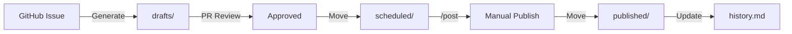

# Storage Reference - LinkedIn Content Automation

**Last Updated**: 2025-07-26  
**Purpose**: Documentation of data storage patterns and file structures

---

## Storage Architecture

This system uses a **file-based storage** approach with Git as the database. All data is stored as markdown files with YAML frontmatter, providing version control, audit trails, and easy human readability.

### Storage Locations

```
content/
├── config/           # System configuration
│   ├── tone.md       # Voice and style settings
│   ├── best-practices.md # Content guidelines
│   ├── memory.md      # Personal facts and schedule
│   └── history.md    # Published post archive
├── drafts/           # New content from PRs
│   └── YYYY-MM-DD-*.md # Individual draft files
├── scheduled/        # Posts ready to publish
│   └── YYYY-MM-DD-*.md # Approved posts
└── published/        # Posts after publishing
    └── YYYY-MM-DD-*.md # Published posts
```

---

## Data Schemas

### 1. Draft Post Schema

**Location**: `content/drafts/YYYY-MM-DD-{slug}.md`  
**Format**: Markdown with YAML frontmatter

```yaml
---
# Required Fields
title: string           # Post headline (max 200 chars)
date: date             # Creation date (YYYY-MM-DD)
tags: array[string]    # Content categorization
priority: enum         # high | normal | low
original_issue: number # GitHub issue reference

# Auto-generated Fields  
scheduled_date: date   # When to publish (YYYY-MM-DD)
status: enum          # draft | queued | published | failed

# Optional Fields
series: string        # Series identifier for connected posts
references: array     # Links to related posts
---

# Post Content

[Markdown formatted content for LinkedIn]
```

#### Field Constraints

| Field | Type | Required | Constraints |
|-------|------|----------|-------------|
| title | string | Yes | 1-200 characters |
| date | ISO date | Yes | Format: YYYY-MM-DD |
| tags | array | Yes | 1-5 tags, lowercase |
| priority | enum | Yes | high, normal, low |
| original_issue | integer | Yes | Valid GitHub issue |
| scheduled_date | ISO date | Auto | Future date only |
| status | enum | Auto | System managed |

---

### 2. Folder-Based Organization

**Structure**: Simple folder states instead of complex scheduling
**Format**: Files move between folders to indicate status

```
content/
├── drafts/           # New posts from PRs
│   └── 2025-01-20-ai-automation.md
├── scheduled/        # Approved posts ready to publish
│   ├── 2025-01-21-startup-lessons.md
│   └── 2025-01-22-team-building.md
└── published/        # Posts after manual publishing
    ├── 2025-01-18-launch-story.md
    └── 2025-01-19-science-matters.md
```

#### Workflow States

| State | Folder | Description |
|-------|--------|-------------|
| Draft | `drafts/` | New content awaiting review |
| Scheduled | `scheduled/` | Approved and ready to publish |
| Published | `published/` | Manually posted to LinkedIn |

#### File Naming Convention

```
YYYY-MM-DD-descriptive-title.md
```

- Date indicates when to publish
- Descriptive title for easy identification
- No complex metadata needed

---

### 3. Configuration Files

#### tone.md Schema

**Location**: `content/config/tone.md`  
**Purpose**: Voice and style configuration

```markdown
# Tone & Voice Guidelines

## Voice Characteristics
- **{Trait}**: {Description}

## Writing Style
- {Style point}

## Language Preferences
- {Preference}

## Emoji Usage
- {Emoji}: {Use case}

## What to Avoid
- {Thing to avoid}
```

#### best-practices.md Schema

**Location**: `content/config/best-practices.md`  
**Purpose**: Content strategy rules

```markdown
# LinkedIn Best Practices

## Post Structure
1. **Hook**: {Description}
2. **Value**: {Description}
3. **CTA**: {Description}

## Optimal Length
- {Length guidelines}

## Engagement Tactics
- {Tactic}

## Hashtag Strategy
- {Strategy}
```

#### memory.md Schema

**Location**: `content/config/memory.md`  
**Purpose**: Personal facts and preferences for accurate content

```markdown
# Personal Memory Bank

## Schedule & Habits
- **Work Schedule**: {Work hours}
- **Sleep Schedule**: {Sleep times}
- **Work Style**: {Preferences}

## Professional Background
- **Current Role**: {Position}
- **Industry Experience**: {Background}
- **Technical Expertise**: {Skills}

## Communication Preferences
- **Response Time**: {Patterns}
- **Meeting Preferences**: {Times}

## Personal Interests
- **Hobbies**: {Activities}
- **Learning Focus**: {Topics}

## Values & Beliefs
- **Work Philosophy**: {Approach}
- **Technology Views**: {Perspective}
```

#### history.md Schema

**Location**: `content/config/history.md`  
**Purpose**: Comprehensive post history for narrative continuity

```markdown
# LinkedIn Posts History - Milko Slavov

## Purpose
Tracks posts to maintain narrative continuity and understand theme evolution.

## Professional Journey Overview
### Phase 1: Technical Expert (7-6 years ago)
- VMware/vCloud Director expertise
- Conference speaking

### Phase 2: Thought Leadership (4 years ago)
- Education and knowledge transfer
- Science advocacy

### Phase 3: Startup Builder (3 years ago)
- Lofty experience
- CTO at TOKI

### Current Focus
- AI-assisted development
- Team building
- Practical over hype

## Key Posts Chronologically

### 1 year ago - AI Coding Insights
**Summary**: "Same things that make software easier for people also help LLMs"
**Key Theme**: Practical AI adoption
**Key Points**:
- Small steps
- Simple codebases
- Fast feedback

[Comprehensive history with narrative threads...]
```

---

## File Operations

### Creating a Draft

```bash
# File naming convention
content/drafts/YYYY-MM-DD-{slug}.md

# Example
content/drafts/2025-01-20-ai-automation-insights.md
```

### Moving Through Pipeline

```
1. Issue created → 
2. Draft generated → content/drafts/
3. PR approved → Move to content/scheduled/
4. Manual publish → Move to content/published/
5. History updated → Summary added to history.md
```

### File State Transitions



---

## Storage Operations

### Read Operations

| Operation | Location | Purpose |
|-----------|----------|---------|
| Load context | config/*.md | Get guidelines |
| Check scheduled | scheduled/*.md | Find due posts |
| Read draft | drafts/*.md | Get content |
| Analyze history | history.md | Narrative context |

### Write Operations

| Operation | Location | Trigger |
|-----------|----------|---------|
| Create draft | drafts/ | Issue opened |
| Move to scheduled | scheduled/ | PR merged |
| Move to published | published/ | Manual post |
| Update history | history.md | Post published |

### Query Patterns

#### Find Today's Posts
```bash
# In scheduled folder
ls content/scheduled/$(date +%Y-%m-%d)-*.md
```

#### Find Posts by Priority
```bash
# In any folder
grep -l "priority: high" content/scheduled/*.md
```

#### Find Posts by Date Range
```bash
# Using filename convention
ls content/scheduled/2025-01-*.md
```

---

## Data Integrity

### Validation Rules

1. **Unique Filenames**: Date prefix prevents collisions
2. **Required Fields**: Frontmatter validation in workflows
3. **Status Consistency**: Only valid state transitions
4. **Reference Integrity**: Issue numbers must exist

### Backup Strategy

1. **Git History**: Complete version control
2. **Branch Protection**: Prevent direct edits
3. **PR Reviews**: Human validation
4. **Action Logs**: Audit trail

### Recovery Procedures

#### Lost Draft Recovery
```bash
# Check Git history
git log --all -- content/drafts/

# Restore deleted file
git restore --source=HEAD~1 content/drafts/filename.md
```

#### Schedule Corruption
```bash
# Rebuild from drafts
ls content/drafts/*.md | while read f; do
  # Extract metadata and rebuild schedule
done
```

---

## Performance Considerations

### File Limits

| Metric | Limit | Impact |
|--------|-------|--------|
| Draft size | 10 KB | LinkedIn post limits |
| Schedule entries | 1000 | Monthly capacity |
| History size | 10 MB | Query performance |
| Tags per post | 5 | Categorization |

### Optimization Strategies

1. **Archive Old Posts**: Move to yearly archives
2. **Index Creation**: Generate lookup files
3. **Lazy Loading**: Load only needed context
4. **Cache Results**: Store processed data

---

## Migration Guide

### From Database to Files

```python
# Pseudo-code for migration
for post in database.posts:
    frontmatter = {
        'title': post.title,
        'date': post.created_at,
        'tags': post.tags,
        'priority': post.priority,
        'original_issue': post.issue_id
    }
    
    filename = f"{post.date}-{slugify(post.title)}.md"
    write_markdown_file(f"content/drafts/{filename}", 
                       frontmatter, 
                       post.content)
```

### From Files to Database

```sql
-- Schema for relational storage
CREATE TABLE posts (
    id SERIAL PRIMARY KEY,
    title VARCHAR(200) NOT NULL,
    content TEXT NOT NULL,
    date DATE NOT NULL,
    tags JSONB,
    priority VARCHAR(10),
    original_issue INTEGER,
    status VARCHAR(20),
    published_url VARCHAR(500),
    created_at TIMESTAMP DEFAULT NOW()
);

CREATE TABLE schedule (
    id SERIAL PRIMARY KEY,
    post_id INTEGER REFERENCES posts(id),
    scheduled_date DATE NOT NULL,
    status VARCHAR(20) NOT NULL,
    published_at TIMESTAMP,
    error TEXT
);
```

---

This storage reference documents the file-based approach used by the LinkedIn Content Automation system. The design prioritizes simplicity, version control, and human readability while maintaining the flexibility to migrate to a traditional database if needed.